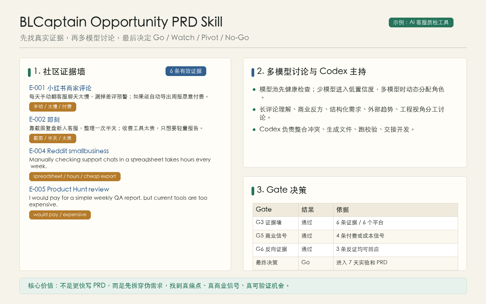
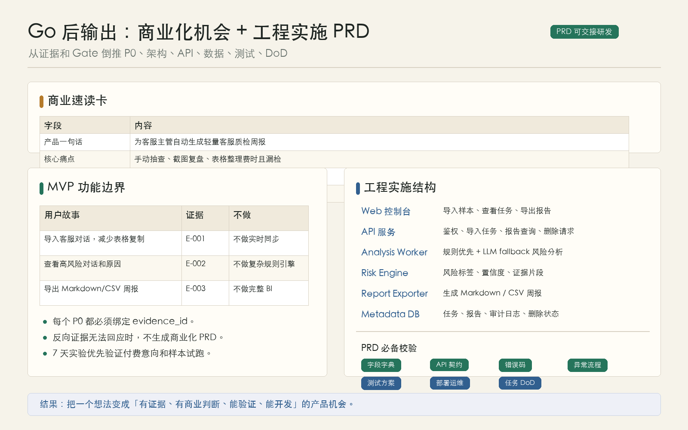
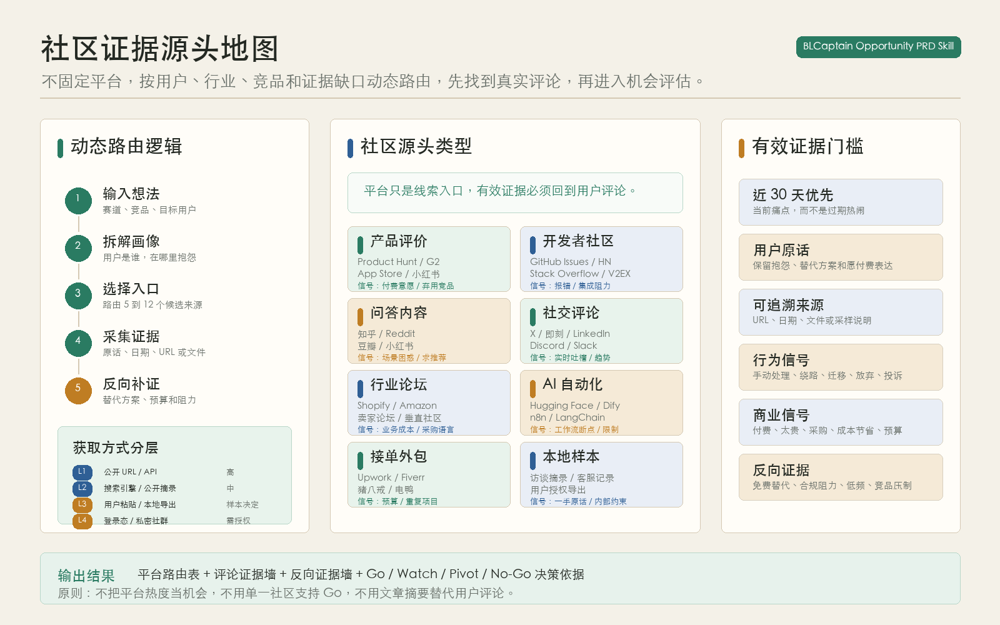
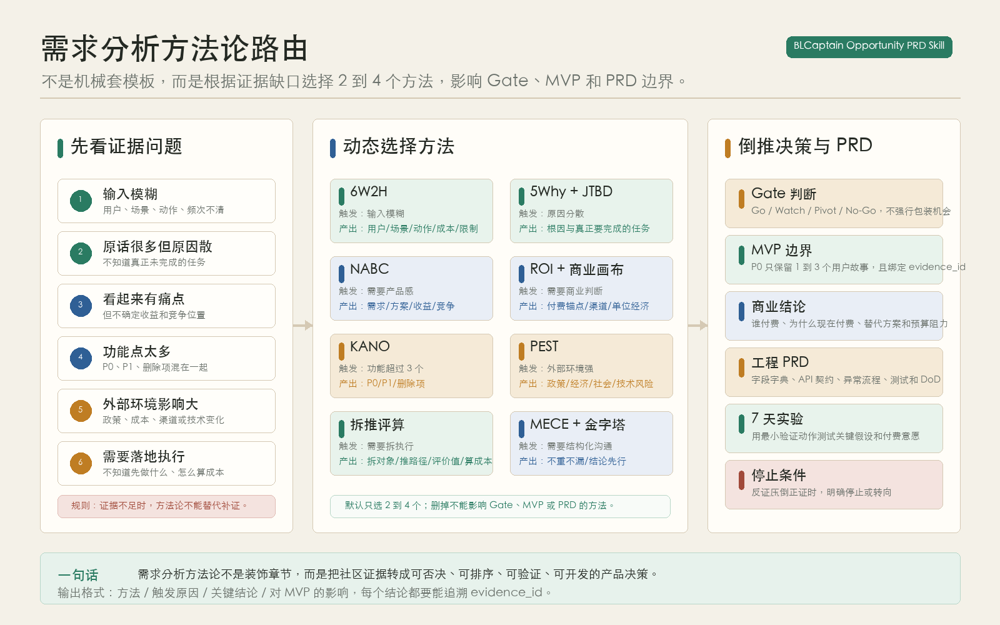

# BLCaptain Opportunity PRD Skill

> 把一个产品想法，从社区评论里的真实痛点，一路推进到可工程实施的商业化 PRD。

[English README](README.en.md)


[](LICENSE)

> **安装**：对支持 Skill 的 Agent 说：  
> 「帮我安装 **BLCaptain Opportunity PRD Skill**：仓库 `github.com/dososo/BLCaptain-Opportunity-PRD-Skill`」

---

## 工作截图

<table>
  <tr>
    <td width="50%">
      
    </td>
    <td width="50%">
      
    </td>
  </tr>
  <tr>
    <td align="center"><strong>先找真实证据，再做多模型讨论与 Gate 决策</strong></td>
    <td align="center"><strong>通过 Go 后，生成可交付开发的商业化 PRD</strong></td>
  </tr>
  <tr>
    <td width="50%">
      
    </td>
    <td width="50%">
      
    </td>
  </tr>
  <tr>
    <td align="center"><strong>不固定平台，按场景动态路由社区证据源头</strong></td>
    <td align="center"><strong>按证据缺口选择方法论，倒推 MVP、Gate 和 PRD</strong></td>
  </tr>
</table>

---

## 为什么要做它

AI 很擅长把一句想法写成一份“看起来完整”的 PRD，但这类文档经常有三个硬伤：

1. **没有真实用户证据**：需求来自脑补，不来自用户原话、手动行为或替代方案。
2. **没有商业判断**：看起来有痛点，但不知道谁会付费、为什么现在付费、替代方案是什么。
3. **不能指导研发**：PRD 有目标和功能，却缺系统架构、字段字典、API 契约、异常流程、测试方案和交付边界。

BLCaptain Opportunity PRD Skill 解决的是这个问题：先从社区评论、产品评价、Issue、问答和用户反馈里找真实痛点，再用反向证据和商业 Gate 判断要不要做，只有通过 Gate 时才生成可工程实施的 PRD。

它不是“灵感生成器”，而是“机会验证流水线”。核心原则很简单：**没有证据，不写确定需求；没有商业信号，不写商业化 PRD；没有工程规格，不交给研发。**

## 它能给你什么

| 维度 | 内容 |
|---|---|
| **输入** | 一句话想法、赛道方向、竞品名称、社区评论样本、公开 URL、本地导出文件 |
| **证据** | 用户原话、日期、来源、行为信号、商业信号、反向证据 |
| **分析** | 意图拆解、社区路由、证据墙、反向证据墙、方法论路由、商业 Gate |
| **决策** | Go / Watch / Pivot / No-Go，不强行把所有想法包装成机会 |
| **输出** | 机会评估报告；只有 Go 时生成商业化机会 + 工程实施 PRD |
| **工程规格** | 系统架构、数据流、字段字典、API 契约、错误码、安全隐私、异常流程、测试、部署、监控、任务 DoD |

## 它解决什么事

适合这些场景：

- 你有一个产品想法，但不知道是不是真痛点。
- 你想从多个社区评论里挖掘可商业化机会。
- 你想避免 AI 根据一句话直接生成“漂亮但虚”的 PRD。
- 你想让 PRD 能直接进入开发，而不是停在方向描述。
- 你想把需求、证据、商业判断和工程交付串成一条可验证链路。

不适合这些场景：

- 只想要脑暴点子，不关心证据。
- 只想写市场宣传文案，不需要产品落地。
- 需要抓取私密社区、绕过登录或处理未授权数据。
- 需要对医疗、法律、金融等高风险领域做最终合规判断。
- 希望工具替你保证商业成功。它只能降低误判，不能替代真实市场验证。

## 核心能力

### 1. 多模型能力池

用户可以配置自己已有的模型或本地命令行模型。Skill 会先做健康检查，再根据可用能力动态分工。

Codex 始终负责主持、整合、生成文件和校验，但 Codex 主持能力不计入外部模型。只有检测到真实可调用的外部模型后，才进入机会分析；如果只有一个外部模型，会进入低置信度模式；如果有多个外部模型，会分配主分析、反方审查、结构化分析、外部视角或工程实现视角。角色根据实际配置动态调整，不绑定固定模型名称。

### 支持模型与多模型配置

这个 Skill 不绑定固定供应商。只要能通过 OpenAI-compatible API 或本机 CLI 返回文本，就可以接入。

| 模型 / 类型 | 推荐接入方式 | 常见用途 |
|---|---|---|
| DeepSeek | `openai_compatible` 或 `cli` | 商业反方、成本收益、结构化审查 |
| GLM | `openai_compatible` 或 `cli` | 中文语境、长评论理解、方法论组织 |
| Claude / Claude Code | `cli` 优先 | 长文本理解、反向压力测试、综合审查 |
| Gemini | `openai_compatible` 或 `cli` | 外部趋势、多模态线索、通用分析 |
| Grok | `openai_compatible` 或 `cli` | 社交视角、实时讨论、反向观点 |
| 本地模型，例如 Ollama、本地脚本 | `cli` | 低成本初筛、代码或结构化辅助 |
| 其他兼容模型 | `openai_compatible` 或 `cli` | 按能力标签动态分配 |

配置文件有两个：

- `templates/model-pool.example.json`：默认空模型池，新用户从这里开始，不含 mock。
- `templates/model-pool.providers.example.json`：可复制的模型接入示例，覆盖 DeepSeek、GLM、Claude CLI、Gemini、Grok、本地模型。

最小操作流程：

1. 复制一份模型配置文件到本地，例如 `my-model-pool.json`。
2. 从 `templates/model-pool.providers.example.json` 复制你需要的模型条目。
3. 只填写 `base_url`、`model`、`api_key_env` 或 `command`。
4. 把真实密钥放到系统环境变量、macOS Keychain、1Password、Bitwarden、dotenv 本地私有文件或模型 CLI 自己的登录态中。
5. 运行健康检查，确认至少 1 个外部模型可用。

OpenAI-compatible 示例：

```json
{
  "id": "deepseek-main",
  "display_name": "DeepSeek",
  "method": "openai_compatible",
  "base_url": "填写官方 OpenAI-compatible Base URL",
  "model": "填写模型名",
  "api_key_env": "DEEPSEEK_API_KEY",
  "capability_tags": ["general", "structure", "commercial_reverse"],
  "test_prompt": "ping"
}
```

CLI 示例：

```json
{
  "id": "claude-cli",
  "display_name": "Claude CLI",
  "method": "cli",
  "command": "填写你的本机非交互命令",
  "capability_tags": ["long_context", "commercial_reverse", "general"],
  "test_prompt": "ping"
}
```

健康检查：

```bash
python3 scripts/check_model_pool.py --config my-model-pool.json
```

检查结果含义：

- `config_required`：没有可用外部模型，只输出配置引导，不声称完成多模型讨论。
- `low_confidence`：1 个外部模型可用，可以做低置信度初筛。
- `standard`：2 到 3 个外部模型可用，可以做主分析、反方和结构化审查。
- `heavy_discussion`：4 个及以上外部模型可用，可以做多视角讨论。

安全原则：

- 配置文件只保存模型名称、调用方式和环境变量名。
- 不把任何真实 API Key、token、cookie、账号信息写进仓库。
- Codex 是主持者，不需要写进外部模型池，也不计入外部模型通过数。
- 缺少配置或凭据时只提示 `missing_config` / `missing_secret`，不伪装成功。

### 2. 动态社区路由

不同机会应该去不同地方找证据。Skill 不固定扫描某几个平台，而是根据目标用户、行业、竞品和场景选择来源。

常见来源类型包括：

- 产品评论
- 开发者 Issue
- 问答社区
- 垂直论坛
- 社交平台评论
- 用户访谈摘录
- 本地导出的评论样本

### 3. 评论证据墙

每条关键证据都要求能追溯：

| 字段 | 说明 |
|---|---|
| evidence_id | 证据编号 |
| 平台 / 来源 | 来自哪里 |
| 日期 | 是否在有效时间窗口内 |
| URL / 文件 | 可复核来源 |
| 用户原话 | 不用二手转述替代 |
| 行为信号 | 手动处理、绕路、迁移、放弃、投诉等 |
| 商业信号 | 付费、太贵、弃用竞品、成本节省、购买意图等 |

### 4. 反向证据

好机会必须经得起反问：

- 有没有免费替代？
- 竞品为什么没做好？
- 用户是否真的有预算？
- 是否有隐私、合规、部署阻力？
- 是否只是低频一次性需求？
- P0 是否被做得太大？

反向证据无法回应时，输出 Pivot 或 No-Go，而不是硬写 PRD。

### 5. 需求分析方法论

方法论不是装饰章节，也不是把所有经典框架机械套一遍。Skill 会根据证据缺口选择最小方法论组合，默认只选 2 到 4 个；每个方法都必须影响 Gate 判断、MVP 边界或 PRD 结论。

| 触发条件 | 方法 | 关键产出 | 对结果的影响 |
|---|---|---|---|
| 输入模糊 | 6W2H | 用户、场景、动作、频次、成本、限制 | 明确调研范围和平台路由 |
| 原话多但原因散 | 5Why + JTBD | 根因和用户真正要完成的任务 | 防止把表层抱怨写成需求 |
| 需要产品感 | NABC | Need、Approach、Benefit、Competition | 判断方案是否有清晰差异化 |
| 需要商业判断 | ROI + 商业画布关键格 | 成本节省、付费锚点、渠道、单位经济 | 决定 Watch、Go 或补证方向 |
| 功能超过 3 个 | KANO | P0、P1、删除项 | 收窄 MVP，避免 P0 膨胀 |
| 外部环境影响大 | PEST | 政策、经济、社会、技术风险 | 识别合规、渠道和时机风险 |
| 需要拆执行 | 拆推评算 | 拆对象、推路径、评价值、算成本 | 把机会拆成 7 天实验和任务 DoD |
| 需要结构化沟通 | MECE + 金字塔 | 分类不重不漏，结论先行 | 让 PRD 能被产品、研发、测试快速理解 |

输出时不会只写方法名称，而会写清楚：

- 为什么选择这个方法。
- 该方法得出的关键结论。
- 结论引用了哪些 evidence_id。
- 它如何改变 MVP、Gate、7 天实验或 PRD 边界。

证据不足时，方法论不能替代补证；方法论结论也不能覆盖反向证据。

### 6. 工程实施级 PRD

只有 Go 后才生成最终 PRD。最终 PRD 必须能指导后续开发，至少包含：

- 商业速读卡
- 机会摘要
- 证据墙
- 目标用户与 JTBD
- 替代方案与竞品缺口
- 需求分析与方法论结论
- MVP 功能边界
- 商业模型与增长路径
- 产品流程
- 系统架构
- 数据流
- 技术选型
- AI / 规则分析方案
- 数据模型与字段字典
- API 契约与错误码
- 权限、安全、隐私与删除策略
- 非功能需求
- 异常流程
- 测试方案
- 部署运维与监控
- 埋点与验证指标
- 开发任务拆分与 DoD
- 7 天验证计划
- 风险、反证与停止条件

## 使用场景

| 你想做 | 这样说 |
|---|---|
| 验证一个产品想法 | 「使用 BLCaptain Opportunity PRD Skill，分析：我想做一个 AI 客服质检工具」 |
| 从评论样本里挖机会 | 「这是我收集的用户评论，请从里面提炼机会点、反向证据和 Go / No-Go 判断」 |
| 准备真实运行 | 「请用这些公开 URL 和我的模型配置跑一次机会评估」 |
| 生成可开发 PRD | 「如果 Gate 通过，请生成商业化机会 + 工程实施 PRD」 |
| 审查 PRD 是否能开发 | 「检查这份 PRD 是否缺 API、字段字典、异常流程、测试和部署方案」 |

## 哪些 Agent 能用

不绑定某一个 Agent。只要你的 Agent 支持读取本地 Skill 文件夹并能调用命令行，就可以使用。

| Agent 类型 | 支持方式 |
|---|---|
| 支持 Skill 的编码 Agent | 直接安装或复制到 skills 目录 |
| 命令行 Agent | 通过本仓库脚本执行扫描、编排和校验 |
| 其他自动化环境 | 读取 `SKILL.md`、`references/`、`templates/` 和 `scripts/` 集成 |

## 安装

```bash
# 通用方式
npx skills add dososo/BLCaptain-Opportunity-PRD-Skill -g

# 或手动安装
git clone https://github.com/dososo/BLCaptain-Opportunity-PRD-Skill.git

# 复制到你的 Agent skills 目录
cp -R BLCaptain-Opportunity-PRD-Skill ~/.codex/skills/BLCaptain-Opportunity-PRD-Skill
```

环境要求：

- Python 3.10+
- 能运行本地命令行
- 如需调用外部模型，请在本机环境变量中配置凭据，不要写入仓库文件

## 怎么用

装好后，在新会话里直接说：

```text
使用 BLCaptain Opportunity PRD Skill，分析：
我想做一个 AI 客服质检工具。

请先检查模型配置，再给出平台路由、证据墙、反向证据、机会评估报告。
只有 Go 时，才生成商业化机会 + 工程实施 PRD。
```

你会得到一组可追溯产物：

1. 模型配置状态
2. 动态模型分工
3. 意图卡
4. 平台路由
5. 评论证据墙
6. 反向证据墙
7. 方法论结论
8. Gate 结果
9. 机会评估报告
10. Go 后的工程实施级 PRD

## 工作流：八步机会验证法

这套 Skill 始终按八步运行：

1. **调研** — 收集社区评论、公开 URL、本地样本、竞品评价和反向证据。
2. **分析** — 抽取用户、场景、行为信号、商业信号和未知项。
3. **计划** — 选择社区路由、方法论组合、验证动作和 P0 范围。
4. **开发** — 只有 Go 时才生成工程实施级 PRD，并拆成可执行任务。
5. **验证** — 校验证据数量、商业信号、反向证据和 P0 绑定关系。
6. **测试** — 运行脚本检查 PRD 结构、API、字段、异常、测试和部署章节。
7. **审计验收** — 检查是否泄露本地路径、真实凭据、私密数据或不可复核结论。
8. **总结** — 输出决策、停止条件、下一步动作和可交接文件。

任一步失败，都回到调研补证，而不是继续编造结论。

## 本地命令

基础校验：

```bash
python3 scripts/quick_validate.py
python3 scripts/simulate_user_flow.py
```

模型健康检查：

```bash
python3 scripts/check_model_pool.py \
  --config templates/model-pool.example.json
```

查看 DeepSeek、GLM、Claude CLI、Gemini、Grok、本地模型配置示例：

```bash
python3 scripts/check_model_pool.py \
  --config templates/model-pool.providers.example.json
```

扫描社区证据：

```bash
python3 scripts/scan_community_evidence.py \
  --idea "AI 客服质检工具" \
  --sources templates/community-sources.example.json
```

扫描反向证据：

```bash
python3 scripts/scan_reverse_evidence.py \
  --idea "AI 客服质检工具" \
  --sources templates/community-sources.example.json
```

端到端工作流：

```bash
python3 scripts/run_opportunity_workflow.py \
  --idea "AI 客服质检工具" \
  --model-config templates/model-pool.example.json \
  --sources templates/community-sources.example.json \
  --output-dir tests/runs/opportunity-workflow
```

校验机会评估或 PRD：

```bash
python3 scripts/validate_opportunity_prd.py path/to/report-or-prd.md
```

## 数据与隐私

- 不提交真实凭据。
- 不把真实密钥写入配置文件。
- 不绕过登录或访问私密社区。
- 不默认抓取生产数据。
- 公开 URL 会被快照成本地文本，便于复核。
- 本地运行产物默认写入 `tests/runs/`，该目录已被 `.gitignore` 忽略。
- `tests/fixtures/` 只保留合成样例和本地校验数据，用于复现脚本行为。
- 发布到 GitHub 的项目不包含 `tests/runs/` 运行输出、缓存目录或本机临时目录。
- 外部模型调用由用户自己的环境负责，Skill 不托管任何服务器。

## 目录结构

```text
BLCaptain Opportunity PRD Skill/
├── SKILL.md                 # 给 Agent 读取的主指令
├── README.md                # 项目说明
├── CHANGELOG.md             # 版本更新记录
├── LICENSE                  # MIT License
├── agents/                  # Agent 展示和入口配置
├── references/              # 方法论、Gate、证据规则、运行说明
├── templates/               # 配置、证据包、机会评估、PRD 模板
├── scripts/                 # 模型检查、证据扫描、工作流编排、校验脚本
└── tests/fixtures/          # 可复现的合成测试样例
```

## 验证标准

一份 Go 后 PRD 必须通过这些检查：

- 至少有可追溯的 evidence_id。
- 至少有反向证据和回应。
- P0 功能必须绑定证据。
- 必须包含 7 天验证计划。
- 必须包含 3 条以上验收剧本。
- 必须包含工程实施章节。
- 必须包含 API 契约、字段字典、错误码、异常流程、测试方案、部署运维和任务 DoD。

否则不应交给研发。

## Roadmap

- 更完善的真实社区来源适配。
- 更强的评论去重、可信度评分和噪声过滤。
- 更细的行业方法论路由。
- 更严格的工程 PRD lint。
- JSON / CSV / Markdown 多格式产物导出。
- 可视化机会评分报告。

## FAQ

**Q：它会直接帮我写 PRD 吗？**  
A：不会一上来就写。它先做证据扫描和机会评估，只有 Gate 通过才生成 PRD。

**Q：没有模型配置能用吗？**  
A：可以先看配置引导和本地样例，但正式分析需要至少一个可用模型或本地命令行模型。

**Q：只有一个模型怎么办？**  
A：会进入单模型低置信度模式，不会伪装成多模型讨论。

**Q：它会保存我的密钥吗？**  
A：不会。配置文件只写环境变量名，真实凭据由你的本机环境管理。

**Q：能抓私密社群或登录后的评论吗？**  
A：不做。默认只处理公开 URL、用户自己提供的导出样本或本地文件。

**Q：Go 后 PRD 可以直接开发吗？**  
A：目标就是让它能进入开发。校验器会检查字段字典、API 契约、异常流程、测试方案、部署运维和任务 DoD，避免只生成方向性文档。

**Q：这个工具能保证商业成功吗？**  
A：不能。它能减少“凭感觉开工”的风险，但最终仍需要真实用户访谈、试用、付费测试和持续迭代。

## 关于作者

由 **爆裂队长NEXT（BLCaptain）** 独立创作与维护。

- GitHub：[@dososo](https://github.com/dososo)
- X / Twitter：[@thinkszyg](https://x.com/thinkszyg)
- 邮箱：[blteam2026@outlook.com](mailto:blteam2026@outlook.com)
- 开源中国传统纹样图录项目维护者：[wenyang.net](https://wenyang.net)

如果这个项目对你有帮助，欢迎 Star、分享，或在 X 上 @我交流。

## License

MIT License. See [LICENSE](LICENSE).
